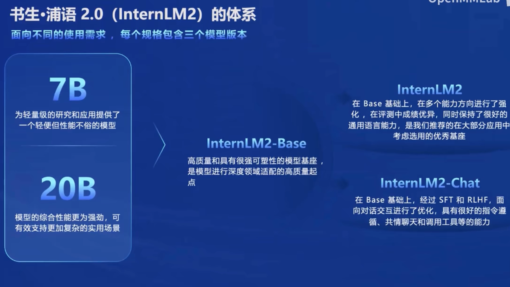
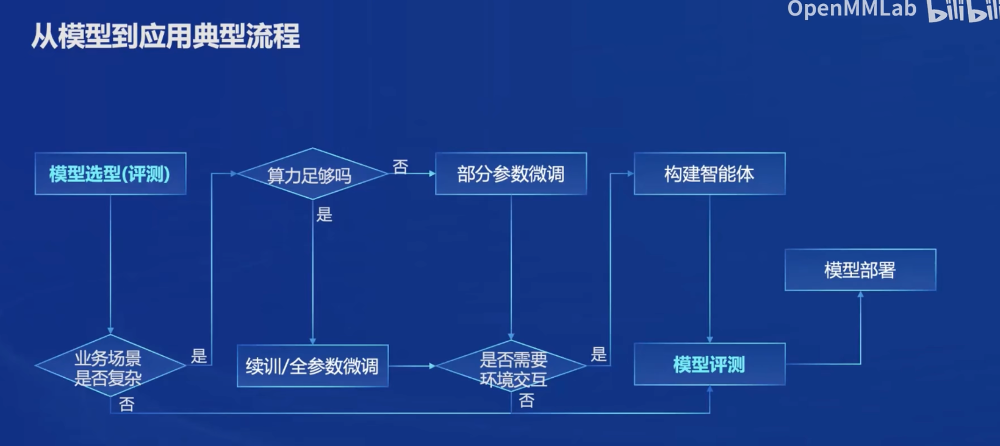
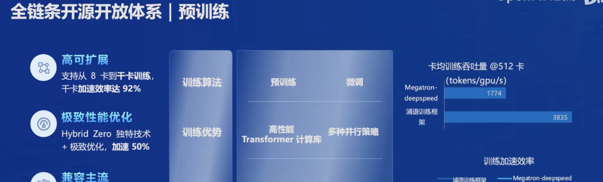
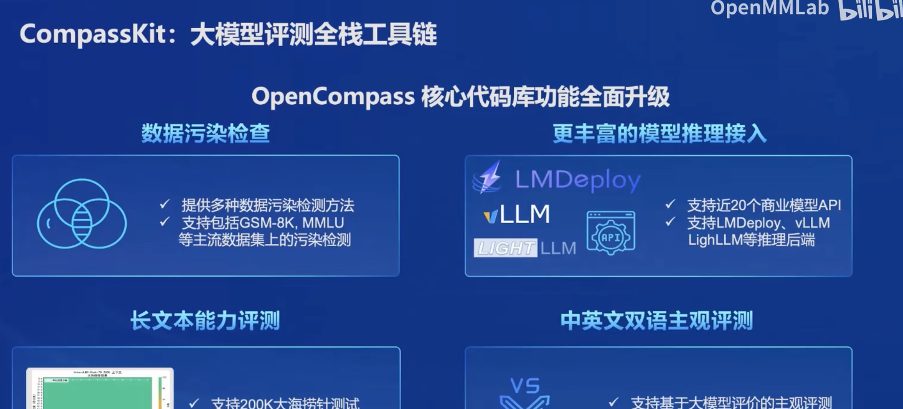
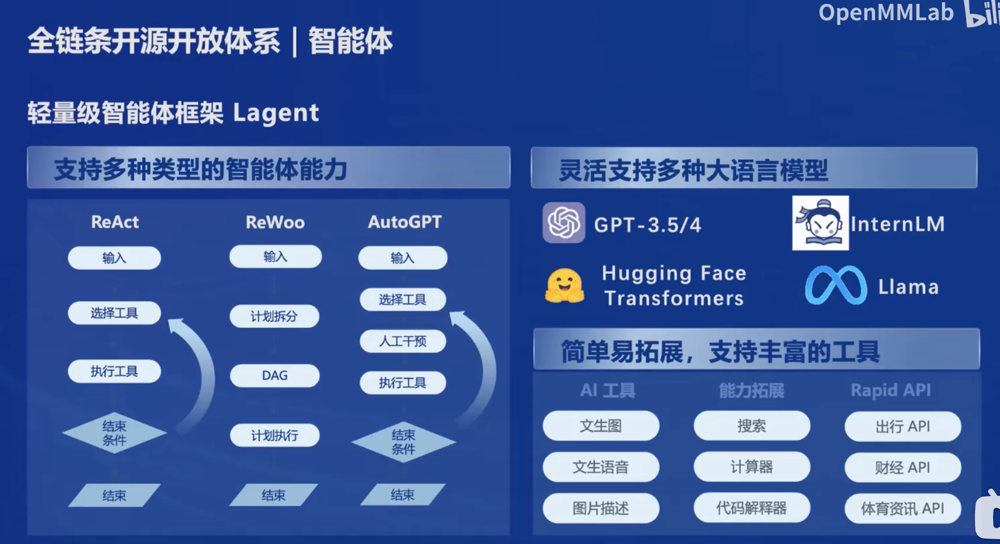

# 1 书生浦语大模型

## 书生浦语2.0 大模型概况

### InternLM2体系

书生浦语大模型2.0分为7B与20B的版本, 在基座模型的规格之上, 还提供了InternLM2 这样的加强模型还有InternLM2-Chat 针对对话交互的微调后的模型, 分别能适应不同的部署环境已经不同的交互方式.

### InternLM2 的亮点总结

- 长文本 (200k上下文, 对比 gpt3.5 16k上下文 )
- 推理, 数学,代码 逻辑性工作上的性能增强
- Agent 的搭建更加方便

## 大模型的典型应用流程

## 书生浦语开源开放体系

### 开放高质量语料数据

### 

- 书生万卷 1.0 2TB 
- 书生万卷 CC 安全,信息密度高

### 高性能,通用预训练框架

- 高拓展,高性能
- 兼容 huggingface等生态

### 微调 (全量参数, 部分参数)

- 增量训练 (文本数据 书,代码)
- 有监督训练 (问答数据)
- Tuner 微调框架 (最低8GB 微调7B模型)

### 测评 OpenCompass 大模型测评体系

综合性测评给的启示: 

1. 整体性能大模型现在还较弱在循环测评策略中
2. 复杂推理是短板

### 部署 LMDeploy

提供python, gRPC, RESTful 不同的借口, 易用

### 智能体 Lagent 框架

- 支持ReAct, ReWoo, AutoGPT 智能体能力

- 支持各种工具和模型

  #### AgentLego多模态智能体工具箱 

  支持多种前沿算法, 主流智能体系统